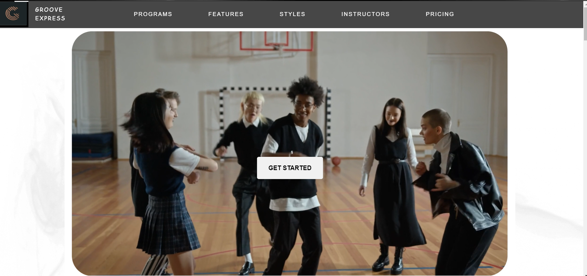

# Front-end_Dev

This is a project showing a front-end design example based on the theme of a dance studio. Different css and javascript effects have been used to describe the programs and features offered by the studio. Unique styles and effects have been used for different sections of the main page (programs, features, styles, instructors, pricing) and the other page.

<h4>Iris Dataset</h4>

